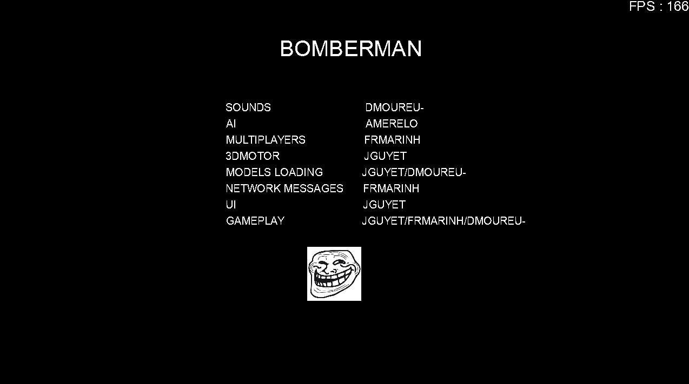

# Bomberman
Bomberman, c'est un classique du jeu video : aussi simple dans son gameplay que fun à jouer ! Vous allez ici profiter de sa simplicité pour faire votre premier gros projet de C++ de facture professionnelle. Vous allez recoder une version de Bomberman, en C++ et avec OpenGL, avec pour objectif de réaliser un jeu le plus abouti possible.

##### devices :
Windows 32 (no tested)  
Linux (no tested)  
MacOS (build OK)  

##### require :
cmake minimum VERSION 3.2  
make minimum VERSION 3.8  
git minimum VERSION 2.1  
opengl framework minimum VERSION 3.3.0  
openal framework minimum VERSION 1.0  
(MACOS) brew  

##### use :
Compilation command :  
`make`  
`./Bomberman`  
Recompilation command `make re`  

##### use server :
`./server/bomber_server`   

##### client properties :
open `bomberman.properties` file on text editor  
`BombermanClient.screen.width=1280`  
`BombermanClient.screen.height=720`  
`BombermanClient.screen.fullscreen=false`  
`BombermanClient.enableSound=true`  
`BombermanClient.enableMusic=false`  
`Network.address=localhost:8964`  
change this settings  

##### sdl2 documentation :
[https://www.libsdl.org/](https://www.libsdl.org/)  

##### glm documentation :
[https://glm.g-truc.net/0.9.8/index.html](https://glm.g-truc.net/0.9.8/index.html)  

##### assimp documentation :
[http://assimp.sourceforge.net/lib_html/index.html](http://assimp.sourceforge.net/lib_html/index.html)  

##### soil documentation :
[http://www.lonesock.net/soil.html](http://www.lonesock.net/soil.html)  

##### Contributors :
Frmarinh    
Dmoureu-  
Amerelo   
Jguyet   

##### Screens :

